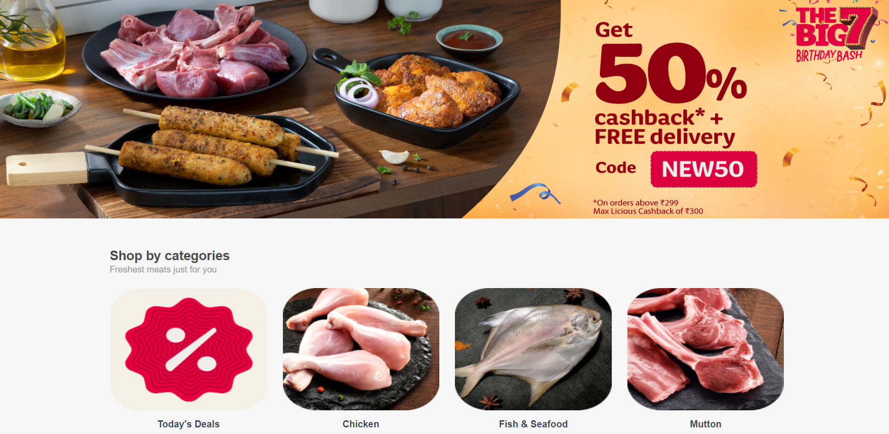
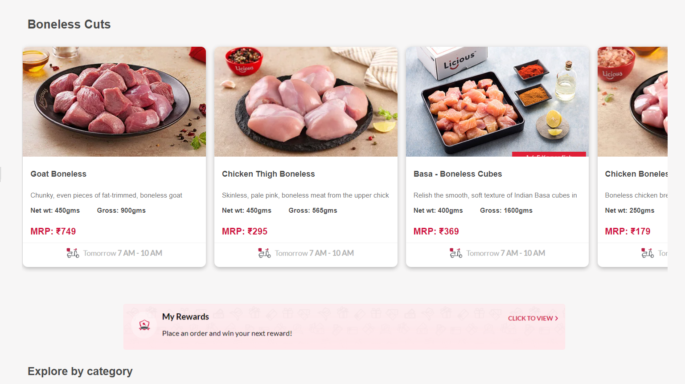

# Licious Clone

* Licious is meat and seafood brand.

* The company operates on a farm-to-fork model, owning the entire back-end supply chain and cold chain.

* Cloned this website in 6 days.

## Features

- SignUp/Login
- Landing page with carousels
- Product pages with sort & filter function
- Add to cart func with Add/Remove/Quantity option
- Payment with applied coupon option

## Tech Stack

* JavaScript
* HTML
* CSS Advance

## 🔗 Links

## Screenshots

